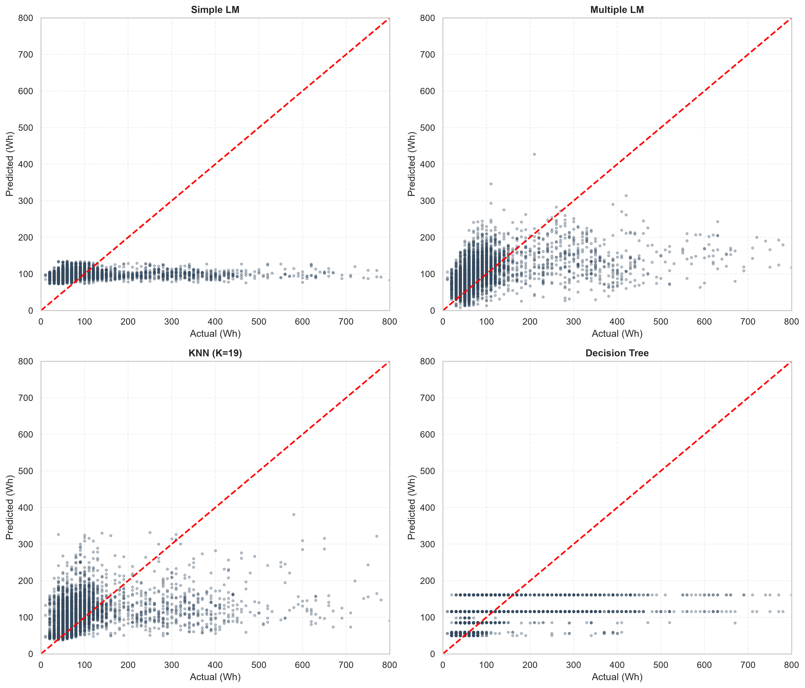
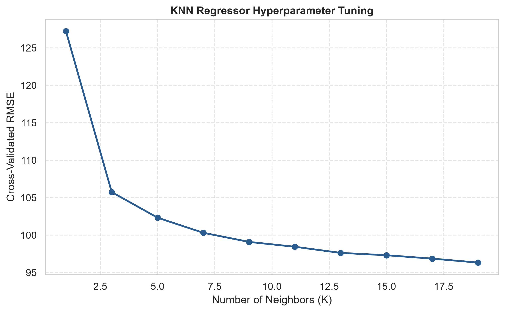
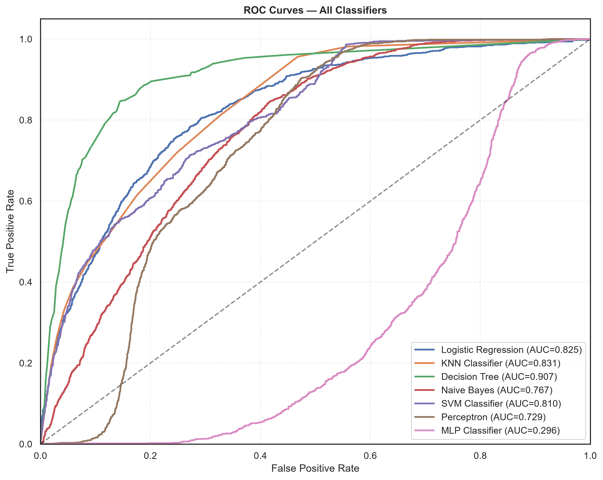
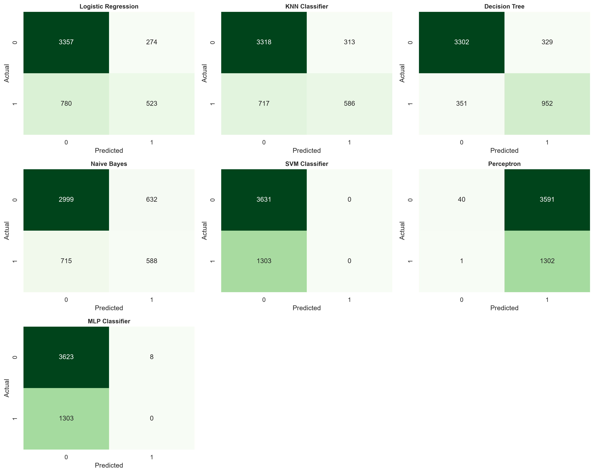
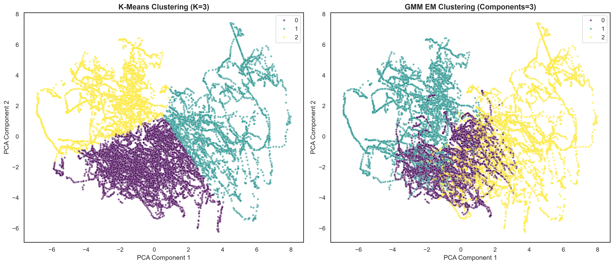
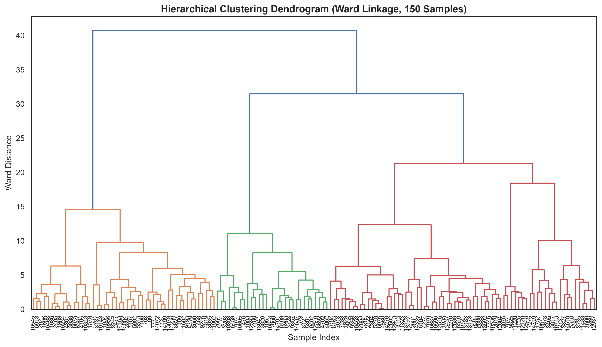
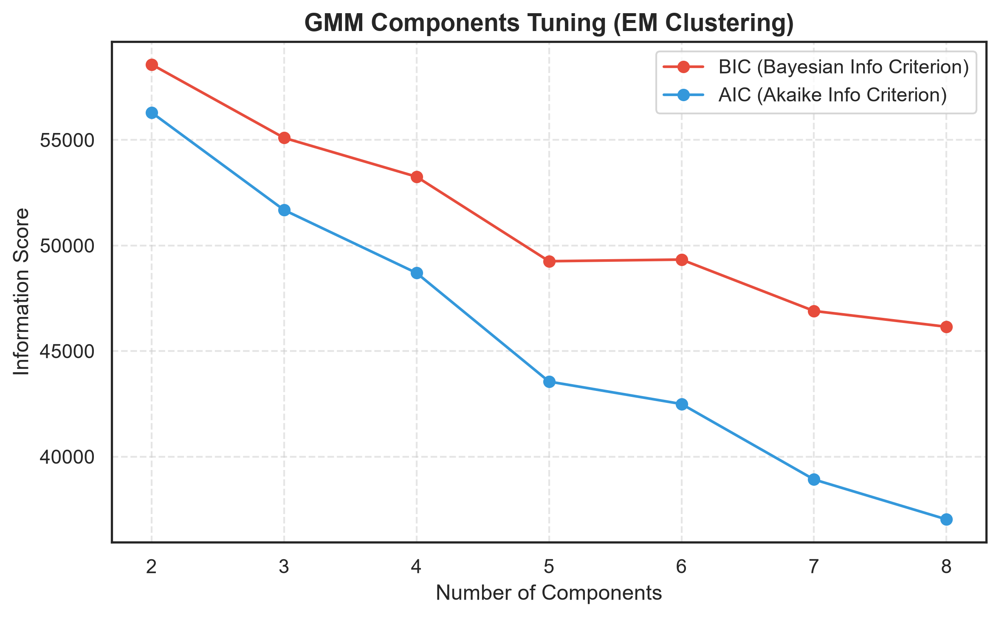

# Appliances Energy Prediction Pipeline

An end-to-end data mining and machine learning pipeline applied to smart home telemetry to predict and analyze residential energy consumption patterns.

This repository hosts data and Python modules associated with the publication:
> Luis M. Candanedo, Véronique Feldheim, Dominique Deramaix. **"Data driven prediction models of energy use of appliances in a low-energy house."** *Energy and Buildings*, Volume 140, April 2017, Pages 81-97. 
> [DOI: 10.1016/j.enbuild.2017.01.083](http://dx.doi.org/10.1016/j.enbuild.2017.01.083).

---

## 📂 Project Structure

```bash
├── energydata_complete.csv      # Raw telemetry data (temperatures, humidities, energy consumption)
├── variables description.txt    # Explanation of all sensor variables and column units
├── requirements.txt            # Package dependencies
├── preprocessing.py            # Phase 1: Data cleansing, scaling, and partitioning
├── regression_mining.py        # Phase 2: Continuous energy usage prediction
├── classification_mining.py    # Phase 3: Peak energy consumption event classification
├── clustering_mining.py        # Phase 4: Unsupervised indoor environmental profiling
├── run_data_mining.py          # Orchestration pipeline runner
├── data_mining_notebook.ipynb  # Interactive Jupyter notebook demonstration
├── explained.md                # Detailed step-by-step code walkthrough and performance breakdown
├── setup.md                    # Environment preparation and setup instructions
└── guide.md                    # Detailed runtime instructions and parameter options
```

---

## ⚡ Quick Start

### 1. Installation
Prepare a clean environment and install dependencies. See [setup.md](setup.md) for full instructions.
```bash
# Setup virtual environment and install packages
python -m venv venv
source venv/bin/activate       # (Windows: venv\Scripts\activate)
pip install -r requirements.txt
```

### 2. Run the Pipeline
Execute the full pipeline to run preprocessing, train regressors/classifiers, perform clustering segmentation, and output all tables and plots:
```bash
python run_data_mining.py
```
For detailed customization and instructions to run modules separately, refer to [guide.md](guide.md).

For a detailed analysis of how every function works and the mathematical intuition behind it, refer to the [explained.md](explained.md) file.

---

## 📊 Summary of Model Performance

### A. Regression Metrics (Continuous Prediction)
Predictions are made on the continuous `Appliances` consumption target (in Wh):

| Model | RMSE (Wh) | MAE (Wh) | $R^2$ Score |
| :--- | :---: | :---: | :---: |
| **Simple Linear Regression ($T_{out}$ only)** | 98.90 | 59.34 | 0.0076 |
| **Multiple Linear Regression (All features)** | **89.59** | **51.07** | **0.1856** |
| **KNN Regressor ($K=19$)** | 92.37 | 50.79 | 0.1343 |
| **Decision Tree Regressor** | 91.80 | 51.46 | 0.1450 |

### B. Classification Metrics (Peak Load Event Prediction)
Classifiers predict binary events where energy consumption exceeds 100 Wh (`High_Energy_Usage` $\ge 100$):

| Model | Accuracy | Precision | Recall | F1-Score | ROC-AUC |
| :--- | :---: | :---: | :---: | :---: | :---: |
| **Logistic Regression** | 0.7864 | 0.6562 | 0.4014 | 0.4981 | 0.8252 |
| **KNN Classifier** | 0.7912 | 0.6518 | 0.4497 | 0.5322 | 0.8313 |
| **Decision Tree Classifier** | **0.8622** | **0.7432** | **0.7306** | **0.7368** | **0.9068** |
| **Gaussian Naive Bayes** | 0.7270 | 0.4820 | 0.4513 | 0.4661 | 0.7674 |

### C. Unsupervised Clustering Metrics
Segments the 18 indoor climate sensor attributes to identify typical environment configurations:

| Algorithm | Silhouette Score | Davies-Bouldin Index |
| :--- | :---: | :---: |
| **K-Means Clustering ($K=3$)** | **0.2911** | **1.1763** |
| **Hierarchical Agglomerative ($K=3$)** | 0.2556 | 1.3054 |
| **GMM (EM Clustering) ($K=3$)** | 0.1757 | 1.5555 |

---

## 🎨 Visualizing Pipeline Results

The pipeline generates high-resolution figures reflecting model optimization and outcomes.

### 1. Regression Predictions & Fitting
Comparison of predictions against actual values across the four regressor architectures:


*KNN Regressor Neighbor (K) Optimization Curve:*


---

### 2. Classification ROC & Confusion Analysis
*Receiver Operating Characteristic (ROC) profiles for all trained classification models:*


*Confusion matrices panel showcasing predicted vs actual categories:*


*Support Vector Machine (SVM) decision boundary plotted in 2D PCA space:*


---

### 3. Unsupervised Environmental Segmentation
*PCA-projected visual representations comparing K-Means ($K=3$) and Gaussian Mixture Model ($Components=3$) cluster assignments:*


*Ward-linkage Dendrogram for sample clusters:*


*GMM AIC/BIC Component Tuning Curves:*

